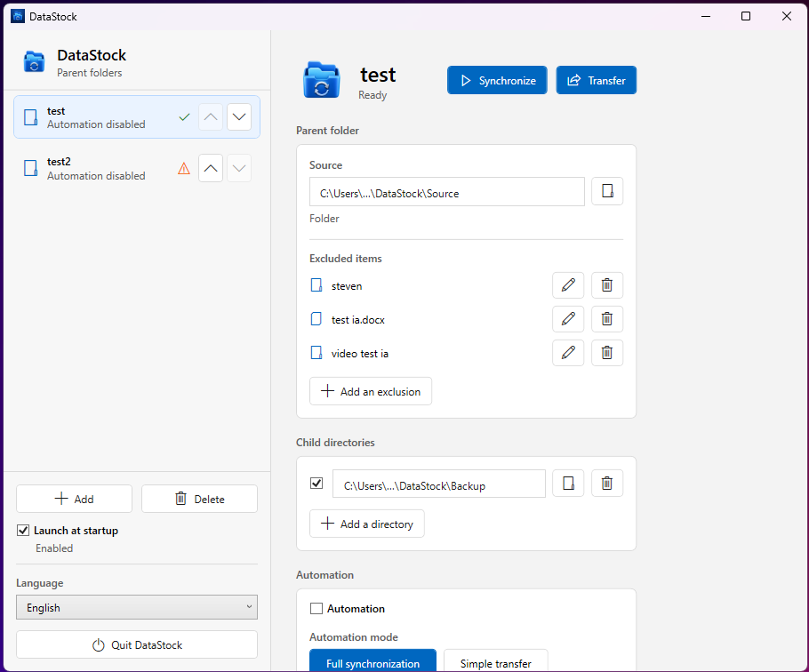

# DataStock for Windows

DataStock is a lightweight Windows desktop app for synchronizing one parent folder with one or more child directories. It supports exclusions, manual synchronization, simple transfer mode, automation, launch at startup, and multilingual localization.



The screenshot above uses anonymized local paths.

## Download

### Compiled Windows app

Download the latest Windows x64 package from GitHub Releases:

[Download DataStock for Windows x64](https://github.com/jieme54/DataStock-for-Win/releases/latest/download/DataStock-0.1.1-Windows-win-x64.zip)

Extract the ZIP file, then run `DataStock.exe`.

This build targets .NET 8. If Windows asks for a runtime, install the [.NET 8 Desktop Runtime](https://dotnet.microsoft.com/en-us/download/dotnet/8.0).

### Source code

Download the open source project from GitHub:

[Download source ZIP](https://github.com/jieme54/DataStock-for-Win/archive/refs/heads/main.zip)

You can also clone it:

```powershell
git clone https://github.com/jieme54/DataStock-for-Win.git
cd DataStock-for-Win
```

## Features

- Manage parent folders and their destination directories.
- Exclude specific files or folders from synchronization.
- Run full synchronization or simple transfer manually.
- Enable automation per folder profile.
- Launch DataStock automatically when Windows starts.
- Switch between the supported interface languages from the app.
- Store settings locally in `%APPDATA%\DataStock\DataStock.json`.

## Build From Source

Requirements:

- Windows 10 or later.
- [.NET 8 SDK](https://dotnet.microsoft.com/en-us/download/dotnet/8.0).

Build the app:

```powershell
dotnet build .\DataStock.Windows.csproj -c Release
```

Publish a Windows x64 build:

```powershell
dotnet publish .\DataStock.Windows.csproj -c Release -r win-x64 --self-contained false -o .\publish\win-x64
```

The executable will be created here:

```text
publish\win-x64\DataStock.exe
```

To package the published app as a ZIP:

```powershell
Compress-Archive -Path .\publish\win-x64\* -DestinationPath .\dist\DataStock-0.1.1-Windows-win-x64.zip -Force
```

## Project Layout

```text
.
|-- DataStock.Windows.csproj
|-- App.xaml
|-- MainWindow.xaml
|-- Localization/
|-- Models/
|-- Resources/
|-- Services/
|-- ViewModels/
|-- docs/
`-- .github/workflows/
```

Release ZIP files are generated automatically by GitHub Actions.

## License

DataStock for Windows is released under the MIT License. See [LICENSE](LICENSE).
